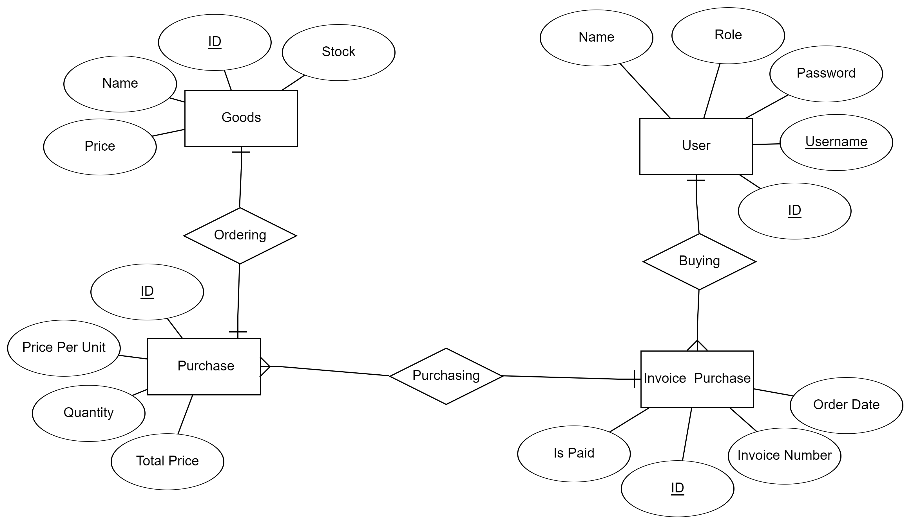

### ERD

Gambar ERD : 

Berikut adalah penjelasan struktur direktori untuk proyek aplikasi berbasis Go yang dibangun dengan clean architecture.:

### Penjelasan Struktur Direktorinya

- **cmd/**:
  Direktori ini digunakan untuk menyimpan entry points bagi aplikasi yang dikembangkan. Biasanya, terdapat satu sub-folder untuk setiap aplikasi yang ingin dibangun, seperti server atau command-line interface (CLI).

- **docs/**:
  Folder ini didedikasikan khusus untuk dokumentasi proyek. Di dalamnya terdapat panduan penggunaan serta informasi yang berkaitan dengan dokumentasi Application Programming Interface (API).

- **internal/**:
  Direktori ini menyimpan kode yang diinternalisasikan dari paket lain, sehingga tidak dimaksudkan untuk diakses di luar proyek ini. Di dalam `internal/`, terdapat beberapa sub-direktori:
  - **dto/**: Menyimpan Data Transfer Object (DTO) yang digunakan untuk memindahkan data antara lapisan aplikasi.
  - **entity/**: Menampung definisi entitas yang digunakan dalam aplikasi.
  - **handler/**: Berisi logika pemrosesan permintaan Hypertext Transfer Protocol (HTTP).
  - **infrastructure/**: Menyimpan implementasi infrastruktur, yang terbagi menjadi sub-direktori berikut:
    - **cache/**: Konfigurasi dan logika yang berkaitan dengan caching.
    - **database/**: Menyediakan koneksi dan aksesibilitas basis data.
    - **middleware/**: Menampung kode-kode middleware yang digunakan untuk memproses permintaan.
    - **repository/**: Menyediakan abstraksi untuk interaksi dengan data, biasanya terkait dengan operasi Create, Read, Update, dan Delete (CRUD) pada basis data.
  - **usecase/**: Menampung logika bisnis yang relevan untuk penggunaan aplikasi.

- **pkg/**:
  Direktorinya ditujukan untuk menyimpan paket yang ingin dibagikan dan digunakan secara publik dalam proyek lain. Terdapat beberapa sub-direktori, di antaranya:
  - **errors/**: Menyimpan definisi kesalahan khusus yang terjadi dalam aplikasi.
  - **generator/**: Mungkin berisi alat untuk menghasilkan kode atau fungsi lainnya.
  - **jwt/**: Implementasi autentikasi yang menggunakan JSON Web Tokens.
  - **response/**: Struktur respons JSON yang konsisten dan digunakan pada API.

- **.env / .env.example**:
  File `.env` digunakan untuk mengatur variabel lingkungan yang sensitif, sedangkan `.env.example` berfungsi memberikan contoh variabel yang diperlukan untuk konfigurasi.

- **.gitignore**:
  Menentukan file dan direktori yang harus diabaikan oleh sistem pengendalian versi Git.

- **go.mod**:
  File ini berfungsi mendefinisikan modul Go, termasuk dependensi yang digunakan dalam proyek.

- **README.md**:
  Merupakan file dokumentasi utama yang menjelaskan tujuan proyek, termasuk panduan instalasi, penggunaan, dan informasi lainnya.

### Instalasi

Terdapat langkah-langkah yang perlu diikuti untuk menginstal dan menjalankan proyek ini.

```bash
# Clone repository
$ git clone https://github.com/adityarizkyramadhan/golang-dot-indonesia

# Masuk ke direktori proyek
$ cd golang-dot-indonesia

# Install dependensi
$ go mod download

# Salin file .env.example
$ cp .env.example .env

# Jalankan aplikasi
$ go run cmd/main.go
```
